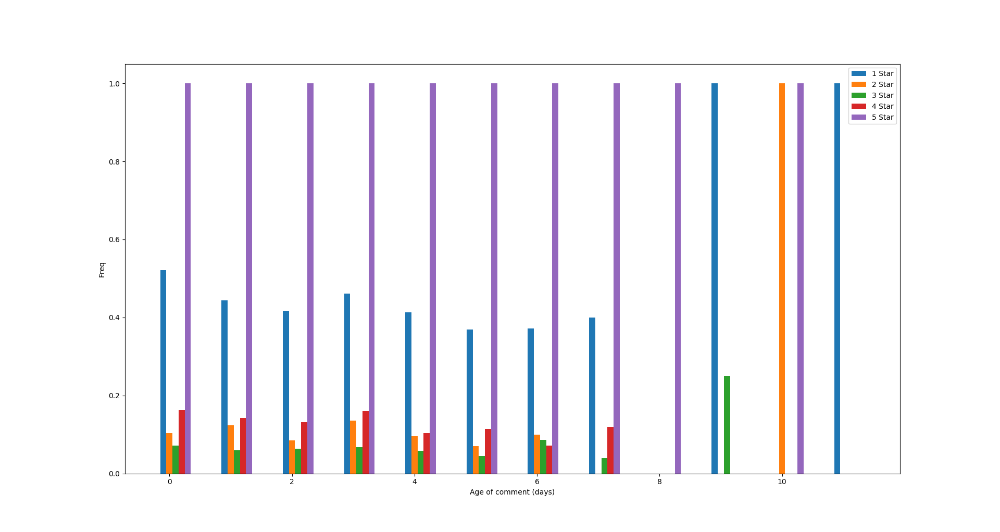
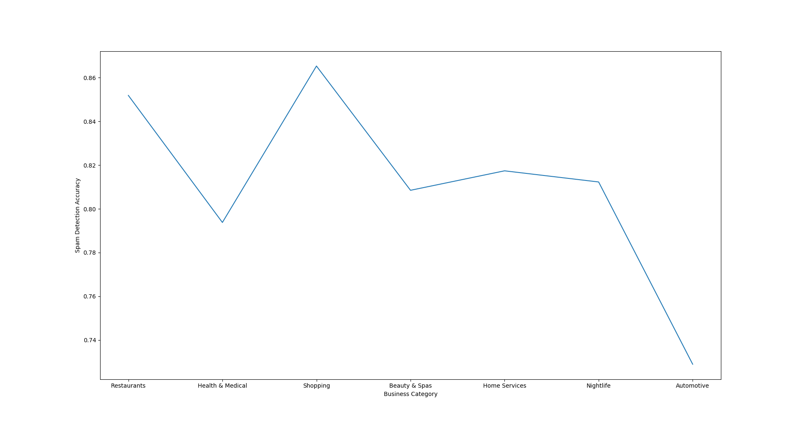
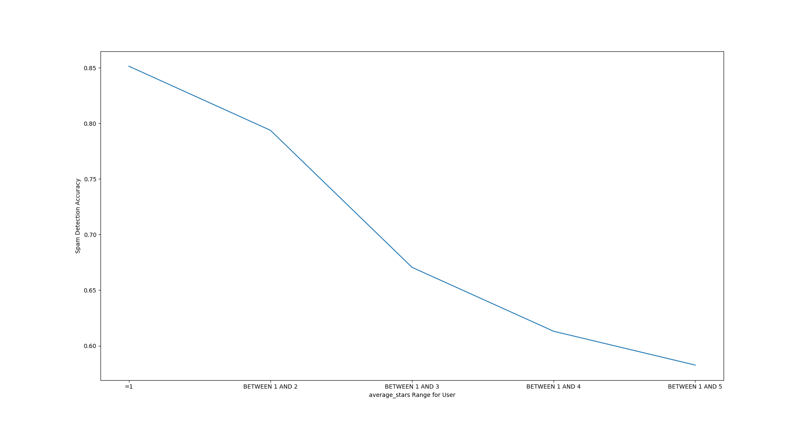

## Part 0. General settings

This report is written in Jupyter Notebook, and all SQL queries are exectuted as python script. Therefore, it follows the sequence of code executing, and all codes share the same namespace. 

Comparison between the run time with and without indexes/keys is integrated with cleaning/analysis part after each queries are executed.

The database server is set up on Amazon Web Service (AWS). The address and other related information can be found below.

Here are the general scripts used through the whole project:


```python
"""Display settings"""
from IPython.display import HTML, display
import tabulate

# optional `heading` arg. If provided it will be added to the first row as the table heading.
def displayResult(queryResult, heading=()):
    if heading != ():
        resultList = (heading,) + queryResult
        display(HTML(tabulate.tabulate([result for result in resultList], tablefmt='html')))
    else:
        display(HTML(tabulate.tabulate([result for result in queryResult], tablefmt='html')))

"""MySQL connection related functions and variables"""

import pymysql

def open_conn():
    """open the connection before each test case"""
    conn = pymysql.connect(user='public', password='ece656yelp',
                                   host='maindb.czbva1am4d4u.us-east-2.rds.amazonaws.com',
                                   database='yelp_db')
    return conn

def close_conn(conn):
    """close the connection after each test case"""
    conn.close()

def executeQuery(conn, query, commit=False, returnResult=True):
    """ fetch result after query"""
    cursor = conn.cursor()
    query_num = query.count(";")
    if query_num > 1:
        if not returnResult:
            cursor.execute(query)
            return
        else:
            for result in cursor.execute(query, params=None, multi=True):
                if result.with_rows:
                    result = result.fetchall()
    else:
        cursor.execute(query)
        result = cursor.fetchall()
    # we commit the results only if we want the updates to the database
    # to persist.
    if commit:
        conn.commit()
    else:
        conn.rollback()
    # close the cursor used to execute the query
    cursor.close()
    return result

yelp_conn = open_conn()
```

## Part I - 1.1 Database structure
Here is the Entity-Relationship diagram of the database. The attributes are not shown because there are too many for some of the tables. Instead, they can be find in the following figure illustrating the relational model.


Here is the relational model of the database. Primary keys are marked as orange and foreign keys are marked as blue. Also the arrows indicate the reference relations between the tables.


## Part I - 1.2 Data cleaning

First some sanity checks and consistency checks were performed on the yelp database. The data in the database should follow the nature rules and should be consistent with each other. After studying the relationship models in of it, we perfomed the following checks and cleaning:
- Common time checks: review or becoming an elite member can not occur before yelp was founded or from the future. 
- Logic consistency checks: a user can not leave a review before creating the account, a user can not become an elite member before becoming a yelp user, people should not check in outside open hours, and the reviews written by each user should be in consistent with that in the user table.

We first got the queries ready, then came up with the following indices to accelerate the running of queries. As we are going to time the execution commands, they are added before further discussion, as shown in 1.2.1. After that in 1.2.2, we will introduce the checking queries and the measures taken to deal with the inconsistency and broken data. 

### 1.2.1 Indexing the sanity check queries

To allow for faster queries additional indices were added to some tables in the database. This includes:

* adding one to the year column in the table elite_years to speed up query_6
  * create index idx_year on elite_years(year)
* adding one to the yelping_since column in the user table
  * create index idx_yelping_since on user(yelping_since)
* creating new columns in the hours table to split the hours column into date, opening_time and closing_time and creating an index for each of these
  * create index idx_day_of_week on hours(day_of_week)
* creating new columns in the checkin table to split the date column into date_of_week and time and creating an index for each of these
  * create index idx_day_of_week on hours(day_of_week)
* creating new columns in the review table to split the date column into year, month, day columns and scrapping the time because its always 00:00:00
  * select count(*) from review where substring_index(date, ' ', -1) != '00:00:00'; #returns 0


```python
index_1_1 = "create index idx_year on elite_years(year);"
index_1_2 = "create index idx_yelping_since on user(yelping_since);"

executeQuery(yelp_conn, index_1_1, returnResult=False)
executeQuery(yelp_conn, index_1_2, returnResult=False)
```


    ()

`index2` is too long to execute here. It uses a procedure to create a new `hour` table with openning and closing time as seperate columns, so we do not need to parse the time column to retrieve the openning and closing tome. In fact, we think it is a bad practice in the original database to put these two in the same columnn as it violates 1NF.
`index3` as shown below, creates indexes for this new table:


```python
index_3_1 = "create index idx_day_of_week on hours_new(day_of_week);"
index_3_2 = "create index idx_opening_time on hours_new(opening_time);"
index_3_3 = "create index idx_closing_time on hours_new(closing_time);"
executeQuery(yelp_conn, index_3_1, returnResult=False)
executeQuery(yelp_conn, index_3_2, returnResult=False)
executeQuery(yelp_conn, index_3_3, returnResult=False)
```


    ()

Again, `index4` creates a new table based on checkin table which creates seperated columns for time digits.

This `index5` series, create the indexes for the new check_in table:


```python
index_5_1 =  "create index idx_day_of_week on checkin_new(day_of_week)"
index_5_2 =  "create index idx_opening_time on checkin_new(checkin_time)"
executeQuery(yelp_conn, query_5_1)
executeQuery(yelp_conn, query_5_2)
```

### 1.2.2 Sanity/consistency check and cleaning

#### 1. Check that no review is from the future or before Yelp's founding


```python
query_1 = "SELECT id, date FROM review WHERE unix_timestamp(date) <= unix_timestamp('2004-10-01')\
           OR unix_timestamp(date) >= unix_timestamp('2018-01-01');"

%time result_1 = executeQuery(yelp_conn, query_1)

result_1
```

    CPU times: user 1.85 ms, sys: 2.5 ms, total: 4.36 ms
    Wall time: 2.75 s
    
    (('03B9-gqbeGoMmPJbNzNT5w', datetime.datetime(2004, 9, 15, 0, 0)),
     ('PbIY2aIyszb6he6J-ey67w', datetime.datetime(2004, 7, 22, 0, 0)))

This shows 2 accounts that were created before Yelp's founding in October 2004.

**Timing analysis:** As shown in the result the query runs in about 3 seconds as shown in the output. When we delete the keys and indexes, the out put is like this:

```python
Wall time: 15.292s
```

Therefore the keys and indexes bring about 5 times improvement in running speed.

This query deletes the illegel records:


```python
clean_1 = "DELETE FROM review WHERE unix_timestamp(date) <= unix_timestamp('2004-10-01')\
           OR unix_timestamp(date) >= unix_timestamp('2018-01-01');"

executeQuery(yelp_conn, clean_1)
```

#### 2. Can't leave a review dated before account creation


```python
query_2 =  "SELECT user.id, user.yelping_since, review.date\
            FROM (user INNER JOIN review ON user.id = review.user_id)\
            WHERE user.yelping_since > review.date\
            GROUP BY user.id;"

%time result_2 = executeQuery(yelp_conn, query_2)
```

    CPU times: user 10.7 ms, sys: 2.18 ms, total: 12.9 ms
    Wall time: 41.6 s

```python
len(result_2)
```


    196

This means these users somehow posted a review before their account was created, suggesting a glitch with their database. Here are 5 of users who have such illege review records:


```python
heading_2 = ("user.id", "user.yelping_since", "review.date")
displayResult(result_2[:5], heading_2)
```


<table>
<tbody>
<tr><td>user.id               </td><td>user.yelping_since </td><td>review.date        </td></tr>
<tr><td>-58CWJ48is4duXgpvsWEGA</td><td>2013-09-18 00:00:00</td><td>2008-10-23 00:00:00</td></tr>
<tr><td>-9NfX8JO_5UVN_h1K8yOcg</td><td>2015-02-12 00:00:00</td><td>2010-02-26 00:00:00</td></tr>
<tr><td>-kEsfYKPs1_rgEWEIui2Mw</td><td>2015-02-14 00:00:00</td><td>2014-04-07 00:00:00</td></tr>
<tr><td>-KP8Me2KRqO7IwKIaFL-Vg</td><td>2013-10-19 00:00:00</td><td>2013-09-02 00:00:00</td></tr>
<tr><td>09T8OU8BDhQkiU8m4vZy_A</td><td>2013-10-21 00:00:00</td><td>2013-10-16 00:00:00</td></tr>
</tbody>
</table>


**Timing analysis:** It takes about 40 seconds to run the query. After we deleted all indexes and keys we ran it again by setting the time out threshold to 5 minutes, and it timed out.

This query deletes illegal reviews:


```python
clean_2 =  "DELETE FROM review WHERE id in\ 
            (SELECT review.id FROM (user INNER JOIN review ON user.id = review.user_id)\
            WHERE user.yelping_since > review.date\
            GROUP BY user.id);"

executeQuery(yelp_conn, clean_2)
```

#### 3. Can't be elite in a year before their account was made


```python
query_3 =  "SELECT user.id, user.yelping_since AS Date_of_yelping, elite_years.year AS Year_of_Elite\
            FROM (user INNER JOIN elite_years ON user.id = elite_years.user_id)\
            WHERE YEAR(user.yelping_since) > elite_years.year\
            GROUP BY user.id;"

%time result_3 = executeQuery(yelp_conn, query_3)
```

    CPU times: user 993 µs, sys: 1.05 ms, total: 2.04 ms
    Wall time: 728 ms

```python
len(result_3)
```


    0

No illegal elite users records are found in the notebook.

**Timing analysis:** This query runs quite fast (within 1 second). However, somehow it timed out (>5min threshold we set) when it is run on a database without keys and indexes. We think it is because this query involves joining operations.


```python
heading_3 = ("user.id", "user.yelping_since", "elite_year.year")
displayResult(result_3[:5], heading_3)
```


<table>
<tbody>
<tr><td>user.id</td><td>user.yelping_since</td><td>elite_year.year</td></tr>
</tbody>
</table>


#### 4. Can't checkin outside open hours


```python
query_4 = "SELECT COUNT(*) FROM checkin JOIN (SELECT hours.business_id, SUBSTRING_INDEX(hours, '|', 1)\
          AS day_of_week, SUBSTRING_INDEX(SUBSTRING_INDEX(hours, '|', - 1), '-', 1) AS opening_time,\
          SUBSTRING_INDEX(SUBSTRING_INDEX(hours, '|', - 1), '-', - 1) AS closing_time FROM hours)\
          AS a ON (a.business_id = checkin.business_id\
          AND a.day_of_week = SUBSTRING_INDEX(checkin.date, '-', 1))\
          WHERE (a.opening_time > SUBSTRING_INDEX(checkin.date, '-', - 1)\
          OR a.closing_time < SUBSTRING_INDEX(checkin.date, '-', - 1));"

%time result_4 = executeQuery(yelp_conn, query_4)
result_4[0]
```

```python
CPU times: user 5.56 ms, sys: 3.52 ms, total: 9.08 ms
Wall time: 5min 14s
(55493,)
```

**Timing analysis:** This query takes about 5 mins to run. After we removed the keys and indices, the run time becomes incredibly long so we shut it down.

This shows that there are many check ins that occur outside of the businesses open hours which are potentially invalid checkins, but this is not a guarantee because it is possible that the business changed their hours of operation at some point after someone checked in, resulting in the discrepency. 

This also shows the need within the database for the date column in the checkin and the hours column in the hours table to be normalized by splitting into date, opening time and closing time columns as this would save computation time having to perform substring_index computations on every row. No change is made to the database to correct this because it may sometimes happen since the business may change its open hours without updating that on yelp.

#### 5. `User.review_count` cannot be less than the sum of the number of reviews by a user


```python
query_5 = "select count(*) from user join (select count(user_id) as countedReviews, user_id from\
           review group by user_id) as a on a.user_id = user.id where a.countedReviews > review_count;"
%time result_5 = executeQuery(yelp_conn, query_5)
print(result_5[0])
```

    CPU times: user 6.4 ms, sys: 4.47 ms, total: 10.9 ms
    Wall time: 3min 49s
    (1323,)

**Timing analysis:** As shown above it takes about 4min. After deleting all indexes and keys the run time was too long so and was interrupted.

This shows that the way Yelp gets the review_count number is potentially flawed since it should never count there being less reviews than the number of reviews provided for each user, unless the dataset that it was acquiring the count from was out of date. 

This query updates the incorrect review_count:


```python
clean_5_1 = "CREATE VIEW review_counts_for_users AS\
             SELECT user_id, count(user_id) AS count\
             FROM review GROUP BY user_id;"

clean_5_2 = "UPDATE user SET review_count = (SELECT count\
             FROM review_counts_for_users WHERE id=user_id);"

executeQuery(yelp_conn, clean_5_1)
executeQuery(yelp_conn, clean_5_2)
```

#### 6. Cannot be Elite in an invalid year
Invalid years include ones before 2004, years in the future or years they didn't post a review, tip or photo.


```python
query_6 = "select count(*) from elite_years join \
           (SELECT user_id, SUBSTRING_INDEX(date, '-', 1) AS year FROM review) \
           as a on a.user_id=elite_years.user_id and a.year = elite_years.year \
           group by elite_years.user_id, elite_years.year;"
%time result_6 = executeQuery(yelp_conn, query_6)
print(result_6[0])
```

    CPU times: user 2.3 ms, sys: 1.39 ms, total: 3.69 ms
    Wall time: 2min 23s
    (37,)

**Timing analysis:** Again this query includes joining operations, so it took very long time if the keys and indexes are removed. Overall, huge improvement can be observed when keys and indexes are applied.

In total there are 186900 entries in elite_years. 37 appear to be erroneous. This query deletes these incorrect elite records:


```python
clean_6 = "DELETE FROM elite_years where user_id in 
             (select E.user_id from (SELECT * FROM elite_years) AS E join\
             (SELECT user_id, SUBSTRING_INDEX(date, '-', 1) AS year FROM review)\
             as a on a.user_id=E.user_id and a.year = E.year\
             group by E.user_id, E.year);"
    
executeQuery(yelp_conn, clean_6)
```

## Part I - 1.3 Data Analysis

```python
import project_funclib

import pymysql
import nltk
import pickle
from matplotlib import pyplot
from random import shuffle
from pprint import pprint

from sklearn.naive_bayes import GaussianNB
from sklearn.ensemble import RandomForestClassifier
from sklearn.metrics import accuracy_score, precision_score, recall_score, f1_score
from nltk.classify.scikitlearn import SklearnClassifier
from sklearn.feature_extraction.text import CountVectorizer
from sklearn.preprocessing import LabelEncoder
from sklearn.model_selection import train_test_split


def find_features(review, frequent_words):
    '''Find the which words in the review are contained within the word_features
    what were determined from the movie review dataset'''
    words = review.split()
    features = dict.fromkeys(frequent_words, False)
    for word in words:
        if word in frequent_words:
            features[word] = True
    return features


def isEnglish(text):
    try:
        text.encode(encoding='utf-8').decode('ascii')
    except UnicodeDecodeError:
        return False
    else:
        return True


def build_dataset_from_query(query, documents, all_words, label):
    '''Takes in the raw data from the SQL query and performs POS tagging as well as
    cleans the data to remove foreign language reviews and symbols'''
    for review in project_funclib.executeQuery(query):
        text = review[0].replace('-', ' ').replace('/', ' ').replace('.', ' ').lower()
        if not isEnglish(text):
            continue
        documents.append((text, label))
        words = nltk.tokenize.word_tokenize(text)
        POS = nltk.tag.pos_tag(words)
        #  [print(word, tag) for word, tag in POS if tag.startswith('J')]
        [all_words.append(w.lower()) for w, tag in POS if tag.startswith(('J', 'R'))]
    return


def build_feature_set(spam_query, ham_query):
    '''Takes in the raw data from the SQL query and formats it correctly for
    the NLTK classifier'''
    documents = []
    all_words = []
    build_dataset_from_query(spam_query, documents, all_words, 'spam')
    build_dataset_from_query(ham_query, documents, all_words, 'ham')
    # list of all words of interest from reviews (determined by select_tags
    all_words = nltk.FreqDist(all_words)
    # Select the top N most frequent words from this list to select as words
    # that indicate a review is spam
    word_features = set(list(all_words.keys())[:5000])
    feature_sets = [(find_features(review, word_features), category) for
                    (review, category) in documents]
    shuffle(feature_sets)
    return feature_sets


def build_sk_feature_set(spam_query, ham_query):
    '''Takes in the raw data from the SQL query and formats it correctly for
    the sklearn classifiers'''
    documents = []
    all_words = []
    y = []
    orpus = []
    build_dataset_from_query(spam_query, documents, all_words, 'spam')
    build_dataset_from_query(ham_query, documents, all_words, 'ham')
    for text, label in documents:
        y.append(label)
        orpus.append(text)
    cv = CountVectorizer(max_features=5000)
    x = cv.fit_transform(orpus).toarray()
    le = LabelEncoder()
    y = le.fit_transform(y)
    return x, y


def naive_bayes_classifier(training_set, testing_set):
    classifier = nltk.NaiveBayesClassifier.train(training_set)
    accuracy = nltk.classify.accuracy(classifier, testing_set)
    classifier.show_most_informative_features(5)
    return accuracy


def gaussianNB_classifier(X_train, X_test, y_train, y_test):
    '''Applies sklearn's gaussianNB algorithm to the feature set'''

    gaussian_nb_classifier = GaussianNB()
    gaussian_nb_classifier.fit(X_train, y_train)
    pred = gaussian_nb_classifier.predict(X_test)
    print('gaussianNB Accuracy score: {}'.format(accuracy_score(y_test, pred)))
    print('gaussianNB Precision score: {}'.format(precision_score(y_test, pred)))
    print('gaussianNB Recall score: {}'.format(recall_score(y_test, pred)))
    print('gaussianNB F1 score: {}'.format(f1_score(y_test, pred)))


def random_forest_classifier(X_train, X_test, y_train, y_test):
    '''Applies sklearn's random forest algorithm to the feature set'''

    classifier1 = RandomForestClassifier(n_estimators=15, criterion='entropy')
    classifier1.fit(X_train, y_train)
    predRF = classifier1.predict(X_test)
    print('RF Accuracy score: {}'.format(accuracy_score(y_test, predRF)))
    print('RF Precision score: {}'.format(precision_score(y_test, predRF)))
    print('RF Recall score: {}'.format(recall_score(y_test, predRF)))
    print('RF F1 score: {}'.format(f1_score(y_test, predRF)))


def train_classifiers(category, ages, num_results, num_reviews):
    '''Executes the SQL queries to get the necessary data and calls the
    classification algorithms on the data after it is formatted correctly'''

    spam_query = "SELECT text FROM (SELECT text, business_id, user_id, date from review \
            WHERE useful = 0 AND funny = 0 AND cool = 0) as c JOIN\
            (SELECT id, yelping_since from user where average_stars = (5 or 1) AND review_count = 1)\
            AS a ON a.id=c.user_id JOIN (select business_id from category WHERE\
            category = '%s') as b USING(business_id) WHERE\
            c.date - a.yelping_since BETWEEN %d and %d limit %d;"\
            % (category, ages[0]*100000000000, ages[1]*100000000000, num_results)
    ham_query = "SELECT text FROM review JOIN (select id from user where\
            review_count > %d) as a ON a.id=review.user_id JOIN (SELECT\
            business_id from category where category='%s') as b on\
            review.business_id=b.business_id limit %d" % (num_reviews, category, num_results)
    # Build the feature sets from the reviews returned by each query
    # They will each be labeled spam or ham (ham are not spam)
    feature_sets = build_feature_set(spam_query, ham_query)
    len_data = int(len(feature_sets) * 0.5)
    training_set = feature_sets[:len_data]
    testing_set = feature_sets[len_data:]
    # These are additional classification algorithms that were tried but
    # removed to speed up computation time
    #  x, y = build_sk_feature_set(spam_query, ham_query)
    #  X_train, X_test, y_train, y_test = train_test_split(x, y, test_size=0.30)
    #  random_forest_classifier(X_train, X_test, y_train, y_test)
    #  gaussianNB_classifier(X_train, X_test, y_train, y_test)
    return naive_bayes_classifier(training_set, testing_set)


num_results = 1000  # Total number of results to analyze from each query to speed up execution
age = (0, 0)  # The time between account creation and the first review for accounts with 1 review
category = 'Restaurants'  # The category of businesses to analyze
num_reviews = 10  # The number of reviews an account has to leave to be classified as not spam

# Analyze the number of reviews between 2 and 101 as the minimum required to not be spam
accuracy = []
for num_reviews in range(2, 21, 2):
    accuracy.append(train_classifiers(category, age, num_results, num_reviews))

pyplot.figure(1)
pyplot.plot(range(0, 101, 10), accuracy)
pyplot.xlabel('review_count by User')
pyplot.ylabel('Spam Detection Accuracy')

# Analyze ages of reviews between 0 and 7 days, with 0 having the biggest population
accuracy = []
ages_high = [0]
ages_low = [0]
[ages_high.append(i) for i in range(6)]
[ages_low.append(i) for i in range(1, 7)]
for age_low, age_high in zip(ages_low, ages_high):
    ages = (age_low, age_high)
    accuracy.append(train_classifiers(category, ages, num_results, num_reviews))

pyplot.figure(2)
pyplot.plot(ages_low, accuracy)
pyplot.xlabel('Time Between Account Creation and First Review (days)')
pyplot.ylabel('Spam Detection Accuracy')

# Analyze the accuracy of spam detection across different categories of businesses
accuracy = []
categories = ['Restaurants', 'Health & Medical', 'Shopping', 'Beauty & Spas',
              'Home Services', 'Nightlife', 'Automotive']
for category in categories:
    accuracy.append(train_classifiers(category, age, num_results, num_reviews))

pyplot.figure(3)
pyplot.plot(categories, accuracy)
pyplot.xlabel('Business Category')
pyplot.ylabel('Spam Detection Accuracy')
```

Conditions for determining which reviews are SPAM:  
Accuracy with WHERE review_count = 1: 61%  
Accuracy with WHERE review_count = 1 AND review.useful = 0 AND review.funny = 0 AND review.cool = 0: 62%  
Expanding POS tags looked at to include verbs on top of adjective and adverbs: 63%  
Look at the top 100 frequently appearing words instead of 1000: 53%  
Look at the top 5000 frequently appearing words instead of 1000: 66%  
Reducing POS tags looked at just adjectives: 67%  
Remove non-english reviews and replacing - and / with spaces: 67%  
Add review.date -yelping_since = 0: 70%  
Change query to 'SELECT text FROM user join review on user.id=review.user_id where average_stars =  5 or average_stars = 1': 71%  
Change query to 'SELECT text FROM review JOIN user ON user.id=review.user_id WHERE review_count = 1 AND review.useful = 0 AND review.funny = 0 AND review.cool = 0 AND review.date - yelping_since and average_stars = 5 limit 1000': 76%  
Change query to 'SELECT text FROM review JOIN user ON user.id=review.user_id WHERE review_count = 1 AND review.useful = 0 AND review.funny = 0 AND review.cool = 0 AND review.date - yelping_since and average_stars = 1 limit 1000': 80%  
Change query to only include restaurants: 83%
Change query to only include hotels: 85%
Change query to only include restaurants: 85%

### Methods 
Now that we're confident that the data is sufficiently cleaned as to not produce erroneous results from our analysis outside of those of interest, we can begin performing the actual analysis of trends in the data. The trend that was analyzed is the affect different attributes about users and their reviews have on the likelihood that their review is spam. These attributes include the type of business being reviewed, the ratings of the reviews left by users, the average_stars of the user, the time between account creation and  and the review_count of the user. In order to determine if a given query returns reviews that are spam a machine learning classifier was used that implemented a bag-of-words model and applied a naive Bayes and random forest classifier onto this model. The metric we looked at to determine the liklihood that a review is spam is the accuracy of the classifier in classifying the suspected spam reviews when mixed with reviews that are not spam.  
The bag-of-words model takes each spam and not spam review and looks at the words that occur most frequently in the reviews to use those as features. In this case we looked at the top 5000 most occuring adjectives and adverbs in the review to use as features. We found the adjectives and adverbs using NLTK's part of speech tagging on every review and decided to go with these parts of speech because they are the words of interest in reviews in general and provide and easy way to eliminate frequently occuring words in general that are not specific to reviews (ex. 'the' and 'it').  
Classification was performed initially using only a naive Bayes classifier that is built into the NLTK library which uses Bayes theorem to determine the probability that a review is spam given the probability that each feature (word) in the review is spam. If this probability is over 50% then that review is classified as spam. Later on other classificiation algorithms were tried to see if a better classification accuracy could be achieved such as scikit-learn's random forest classifier and gaussian naive Bayes, however in general these algorithms performed worse than NLTK's naive Bayes classifier so it was the only one used to save computation time.  
Accuracy of the spam prediction was determined by splitting the shuffled spam and ham reviews in half, with one half becoming the training set to train the classifier on, and the other half becoming the testing set which the spam classifier is tested on to determine its accuracy.
The metrics analyzed were:
* Categories - Restaurants, Health & Medical, Shopping, Beauty & Spas, Home Services, Nightlife and Automotive were lo
* Age - Time between account creation and first review for potential bot accounts with only a single review, looked between 0 and 6 days one day at a time
* number of reviews - The minimum numbers of reviews that an accounts needs to leave to not be classified as spam
* number of results - the number of rows from each query that were analyzed, this was left fixed at 1000 for speed

### Results



It was found that the longer someone waited to leave their first review from account creation, the less likely it was to be spam. This was expected as any bot account that is created to simply boost up the score of a restaurant would leave a review immediately after creation, as opposed to a real user that may make their account and then not leave a review on a business until they go to one a while later. The downside of this metric is that there are also many real used that create account while at a business and leave an overly positive or negative review because its fresh in their memory.

  

Next, it was found that amoungst the different categories of businesses that Automotive businesses were the least likely to have spam reviews, while shopping locations were the most. Analyzing this further reveals that on average the automotive customers were more likely to have accounts with only one review for the automotive business, suggesting automotive people are less likely to be active users versus shopping locations which have legitimate users that are more active Yelp users so the ones with only one review are more likely to be spam.  



It was also found that the average_stars of the users' account influences the likelihood that their reviews are spam in that if a users' average_stars is 5 or 1 versus if their average_stars is some other value showing that they've given other reviews besides just the top score or the lowest. This metric would miss spam users that use their account for spamming both high and low, instead of only doing one or the other.

### Future Work
While classifiers for spam emails are quite well established, spam classifiers for reviews are more challenging because they lack many of the features that are indicative of spam such as including links or using language that suggests that the person is trying to sell something. However, this is an active area of research and there are other more complex features that have been identified that have been shown to indicate a review is spam such as: [(reference)](reference: http://www.aclweb.org/anthology/P14-1147)

* Using a separate gold standard dataset of honest and deceptive reviews to train with instead of using approximations from the dataset
* Look for spacial details in a review to indicate honesty (ex. terms such as “bathroom”) while deceptive reviews will talk about general concepts such as why or with whom they went to the hotel
* Using Bayesian learning to analyze multiple of these metrics together to draw a more definitive conclusion
* Checking for if there are many grammatical and spelling mistakes 

## Part II. 2.1 User control

### 2.1.1 Description of the problem

In real applications, the Yelp database is expected to be visited by
different groups of people, including customers (users), data analyst
(special users), and developers. In this project, this is further
divided into five categories:

1.  A casual user who uses the application to browse search results.
    These users do not need to have an account; hence, they cannot
    submit reviews.

2.  Critiques that use the application to browse results just like the
    casual user, but they also leave reviews for places they visit. A
    logged in user should only be provided enough privileges to write
    the review.

3.  Business analysts can use the application to produce sales reports
    and may want to do special data mining and analysis. They cannot
    perform IUD (Insert/Update/Delete) operations on the database but
    should have access to creating extra views on the database schema.

4.  Developers working with this database are able to create new tables
    and perform data cleaning and indexing. They are allowed to perform
    IUD operations on the database.

5.  The database admin who has full access over the database.

The principle of granting privilege is to guarantee that each group of
people have sufficient permission in order to protect the database.
First, the list of all privileges in MySQL 5.7 are listed in the Table below, from which we can choose levels for each user
group.

<table border=0 cellpadding=0 cellspacing=0 width=1350 style='border-collapse:
 collapse;table-layout:fixed;width:1011pt;box-sizing: inherit;outline: 0px;
 border-spacing: 0px;font-variant-ligatures: normal;font-variant-caps: normal;
 orphans: 2;text-align:start;widows: 2;-webkit-text-stroke-width: 0px;
 text-decoration-style: initial;text-decoration-color: initial'>
 <col width=199 style='mso-width-source:userset;mso-width-alt:6357;width:149pt;
 box-sizing: inherit'>
 <col width=716 style='mso-width-source:userset;mso-width-alt:22912;width:537pt;
 box-sizing: inherit'>
 <col width=87 span=5 style='width:65pt;box-sizing: inherit;outline: 0px'>
 <tr height=21 style='height:16.0pt;box-sizing: inherit;outline: 0px'>
  <td height=21 width=199 style='height:16.0pt;width:149pt'>Privilege</td>
  <td width=716 style='width:330pt'>Meaning and Grantable Levels</td>
 </tr>
 <tr height=21 style='height:16.0pt;box-sizing: inherit;outline: 0px'>
  <td height=21 style='height:16.0pt;box-sizing: inherit;outline: 0px'
  scope=row>ALL [PRIVILEGES]</td>
  <td style='box-sizing: inherit;outline: 0px'>Grant all privileges at
  specified access level except&nbsp;GRANT OPTION&nbsp;and&nbsp;PROXY.</td>
 
 </tr>
 <tr height=21 style='height:16.0pt;box-sizing: inherit;outline: 0px'>
  <td height=21 style='height:16.0pt;box-sizing: inherit;outline: 0px'
  scope=row>ALTER</td>
  <td style='box-sizing: inherit;outline: 0px'>Enable use of&nbsp;ALTER TABLE.
  Levels: Global, database, table.</td>
 
 </tr>
 <tr height=21 style='height:16.0pt;box-sizing: inherit;outline: 0px'>
  <td height=21 style='height:16.0pt;box-sizing: inherit;outline: 0px'
  scope=row>ALTER ROUTINE</td>
  <td style='box-sizing: inherit;outline: 0px'>Enable stored routines to be
  altered or dropped. Levels: Global, database, procedure.</td>
 
 </tr>
 <tr height=21 style='height:16.0pt;box-sizing: inherit;outline: 0px'>
  <td height=21 style='height:16.0pt;box-sizing: inherit;outline: 0px'
  scope=row>CREATE</td>
  <td style='box-sizing: inherit;outline: 0px'>Enable database and table
  creation. Levels: Global, database, table.</td>
 
 </tr>
 <tr height=21 style='height:16.0pt;box-sizing: inherit;outline: 0px'>
  <td height=21 style='height:16.0pt;box-sizing: inherit;outline: 0px'
  scope=row>CREATE ROUTINE</td>
  <td style='box-sizing: inherit;outline: 0px'>Enable stored routine creation.
  Levels: Global, database.</td>
 
 </tr>
 <tr height=21 style='height:16.0pt;box-sizing: inherit;outline: 0px'>
  <td height=21 style='height:16.0pt;box-sizing: inherit;outline: 0px'
  scope=row>CREATE TABLESPACE</td>
  <td style='box-sizing: inherit;outline: 0px'>Enable tablespaces and log file
  groups to be created, altered, or dropped. Level: Global.</td>
 
 </tr>
 <tr height=21 style='height:16.0pt;box-sizing: inherit;outline: 0px'>
  <td height=21 style='height:16.0pt;box-sizing: inherit;outline: 0px'
  scope=row>CREATE TEMPORARY TABLES</td>
  <td style='box-sizing: inherit;outline: 0px'>Enable use of&nbsp;CREATE
  TEMPORARY TABLE. Levels: Global, database.</td>
 
 </tr>
 <tr height=21 style='height:16.0pt;box-sizing: inherit;outline: 0px'>
  <td height=21 style='height:16.0pt;box-sizing: inherit;outline: 0px'
  scope=row>CREATE USER</td>
  <td style='box-sizing: inherit;outline: 0px'>Enable use of&nbsp;CREATE
  USER,&nbsp;DROP USER,&nbsp;RENAME USER, and&nbsp;REVOKE ALL PRIVILEGES.
  Level: Global.</td>
 
 </tr>
 <tr height=21 style='height:16.0pt;box-sizing: inherit;outline: 0px'>
  <td height=21 style='height:16.0pt;box-sizing: inherit;outline: 0px'
  scope=row>CREATE VIEW</td>
  <td style='box-sizing: inherit;outline: 0px'>Enable views to be created or
  altered. Levels: Global, database, table.</td>
 
 </tr>
 <tr height=21 style='height:16.0pt;box-sizing: inherit;outline: 0px'>
  <td height=21 style='height:16.0pt;box-sizing: inherit;outline: 0px'
  scope=row>DELETE</td>
  <td style='box-sizing: inherit;outline: 0px'>Enable use of&nbsp;DELETE.
  Level: Global, database, table.</td>
 
 </tr>
 <tr height=21 style='height:16.0pt;box-sizing: inherit;outline: 0px'>
  <td height=21 style='height:16.0pt;box-sizing: inherit;outline: 0px'
  scope=row>DROP</td>
  <td style='box-sizing: inherit;outline: 0px'>Enable databases, tables, and
  views to be dropped. Levels: Global, database, table.</td>
 
 </tr>
 <tr height=21 style='height:16.0pt;box-sizing: inherit;outline: 0px'>
  <td height=21 style='height:16.0pt;box-sizing: inherit;outline: 0px'
  scope=row>EVENT</td>
  <td style='box-sizing: inherit;outline: 0px'>Enable use of events for the
  Event Scheduler. Levels: Global, database.</td>
 
 </tr>
 <tr height=21 style='height:16.0pt;box-sizing: inherit;outline: 0px'>
  <td height=21 style='height:16.0pt;box-sizing: inherit;outline: 0px'
  scope=row>EXECUTE</td>
  <td style='box-sizing: inherit;outline: 0px'>Enable the user to execute
  stored routines. Levels: Global, database, table.</td>
 
 </tr>
 <tr height=21 style='height:16.0pt;box-sizing: inherit;outline: 0px'>
  <td height=21 style='height:16.0pt;box-sizing: inherit;outline: 0px'
  scope=row>FILE</td>
  <td style='box-sizing: inherit;outline: 0px'>Enable the user to cause the
  server to read or write files. Level: Global.</td>
 
 </tr>
 <tr height=21 style='height:16.0pt;box-sizing: inherit;outline: 0px'>
  <td height=21 style='height:16.0pt;box-sizing: inherit;outline: 0px'
  scope=row>GRANT OPTION</td>
  <td style='mso-ignore:colspan;box-sizing: inherit;outline: 0px'>Enable
  privileges to be granted to or removed from other accounts. Levels: Global,
  database, table, procedure, proxy.</td>
  
 </tr>
 <tr height=21 style='height:16.0pt;box-sizing: inherit;outline: 0px'>
  <td height=21 style='height:16.0pt;box-sizing: inherit;outline: 0px'
  scope=row>INDEX</td>
  <td style='box-sizing: inherit;outline: 0px'>Enable indexes to be created or
  dropped. Levels: Global, database, table.</td>
 
 </tr>
 <tr height=21 style='height:16.0pt;box-sizing: inherit;outline: 0px'>
  <td height=21 style='height:16.0pt;box-sizing: inherit;outline: 0px'
  scope=row>INSERT</td>
  <td style='box-sizing: inherit;outline: 0px'>Enable use of&nbsp;INSERT.
  Levels: Global, database, table, column.</td>
 
 </tr>
 <tr height=21 style='height:16.0pt;box-sizing: inherit;outline: 0px'>
  <td height=21 style='height:16.0pt;box-sizing: inherit;outline: 0px'
  scope=row>LOCK TABLES</td>
  <td style='box-sizing: inherit;outline: 0px'>Enable use of&nbsp;LOCK
  TABLES&nbsp;on tables for which you have the&nbsp;SELECT&nbsp;privilege.
  Levels: Global, database.</td>
 
 </tr>
 <tr height=21 style='height:16.0pt;box-sizing: inherit;outline: 0px'>
  <td height=21 style='height:16.0pt;box-sizing: inherit;outline: 0px'
  scope=row>PROCESS</td>
  <td style='box-sizing: inherit;outline: 0px'>Enable the user to see all
  processes with&nbsp;SHOW PROCESSLIST. Level: Global.</td>
 
 </tr>
 <tr height=21 style='height:16.0pt;box-sizing: inherit;outline: 0px'>
  <td height=21 style='height:16.0pt;box-sizing: inherit;outline: 0px'
  scope=row>PROXY</td>
  <td style='box-sizing: inherit;outline: 0px'>Enable user proxying. Level:
  From user to user.</td>
 
 </tr>
 <tr height=21 style='height:16.0pt;box-sizing: inherit;outline: 0px'>
  <td height=21 style='height:16.0pt;box-sizing: inherit;outline: 0px'
  scope=row>REFERENCES</td>
  <td style='box-sizing: inherit;outline: 0px'>Enable foreign key creation.
  Levels: Global, database, table, column.</td>
 
 </tr>
 <tr height=21 style='height:16.0pt;box-sizing: inherit;outline: 0px'>
  <td height=21 style='height:16.0pt;box-sizing: inherit;outline: 0px'
  scope=row>RELOAD</td>
  <td style='box-sizing: inherit;outline: 0px'>Enable use
  of&nbsp;FLUSH&nbsp;operations. Level: Global.</td>
 
 </tr>
 <tr height=21 style='height:16.0pt;box-sizing: inherit;outline: 0px'>
  <td height=21 style='height:16.0pt;box-sizing: inherit;outline: 0px'
  scope=row>REPLICATION CLIENT</td>
  <td style='box-sizing: inherit;outline: 0px'>Enable the user to ask where
  master or slave servers are. Level: Global.</td>
 
 </tr>
 <tr height=21 style='height:16.0pt;box-sizing: inherit;outline: 0px'>
  <td height=21 style='height:16.0pt;box-sizing: inherit;outline: 0px'
  scope=row>REPLICATION SLAVE</td>
  <td style='box-sizing: inherit;outline: 0px'>Enable replication slaves to
  read binary log events from the master. Level: Global.</td>
 
 </tr>
 <tr height=21 style='height:16.0pt;box-sizing: inherit;outline: 0px'>
  <td height=21 style='height:16.0pt;box-sizing: inherit;outline: 0px'
  scope=row>SELECT</td>
  <td style='box-sizing: inherit;outline: 0px'>Enable use of&nbsp;SELECT.
  Levels: Global, database, table, column.</td>
 
 </tr>
 <tr height=21 style='height:16.0pt;box-sizing: inherit;outline: 0px'>
  <td height=21 style='height:16.0pt;box-sizing: inherit;outline: 0px'
  scope=row>SHOW DATABASES</td>
  <td style='box-sizing: inherit;outline: 0px'>Enable&nbsp;SHOW
  DATABASES&nbsp;to show all databases. Level: Global.</td>
 
 </tr>
 <tr height=21 style='height:16.0pt;box-sizing: inherit;outline: 0px'>
  <td height=21 style='height:16.0pt;box-sizing: inherit;outline: 0px'
  scope=row>SHOW VIEW</td>
  <td style='box-sizing: inherit;outline: 0px'>Enable use of&nbsp;SHOW CREATE
  VIEW. Levels: Global, database, table.</td>
 
 </tr>
 <tr height=21 style='height:16.0pt;box-sizing: inherit;outline: 0px'>
  <td height=21 style='height:16.0pt;box-sizing: inherit;outline: 0px'
  scope=row>SHUTDOWN</td>
  <td style='box-sizing: inherit;outline: 0px'>Enable use of&nbsp;mysqladmin
  shutdown. Level: Global.</td>
 
 </tr>
 <tr height=21 style='height:16.0pt;box-sizing: inherit;outline: 0px'>
  <td height=21 style='height:16.0pt;box-sizing: inherit;outline: 0px'
  scope=row>SUPER</td>
  <td style='mso-ignore:colspan;box-sizing: inherit;outline: 0px'>Enable
  use of other administrative operations such as&nbsp;CHANGE MASTER
  TO,&nbsp;KILL,&nbsp;PURGE BINARY LOGS,&nbsp;SET GLOBAL, and&nbsp;mysqladmin
  debug&nbsp;command. Level: Global.</td>
 </tr>
 <tr height=21 style='height:16.0pt;box-sizing: inherit;outline: 0px'>
  <td height=21 style='height:16.0pt;box-sizing: inherit;outline: 0px'
  scope=row>TRIGGER</td>
  <td style='box-sizing: inherit;outline: 0px'>Enable trigger operations.
  Levels: Global, database, table.</td>
 
 </tr>
 <tr height=21 style='height:16.0pt;box-sizing: inherit;outline: 0px'>
  <td height=21 style='height:16.0pt;box-sizing: inherit;outline: 0px'
  scope=row>UPDATE</td>
  <td style='box-sizing: inherit;outline: 0px'>Enable use of&nbsp;UPDATE.
  Levels: Global, database, table, column.</td>
 
 </tr>
 <tr height=21 style='height:16.0pt;box-sizing: inherit;outline: 0px'>
  <td height=21 style='height:16.0pt;box-sizing: inherit;outline: 0px'
  scope=row>USAGE</td>
  <td style='box-sizing: inherit;outline: 0px'>Synonym for&nbsp;"no privileges"</td>
 
 </tr>
</table>

### 2.1.2 Group 1


For the first group of users, they only browse information about the
business, including their opening hours, stars, reviews, without signing
in so they do not need to write information into the database. In some
cases, if the app allows some specific types of anonymous
communications, such as marking a review as “cool" or “useful” by a
visitor, then the permission should be extended to allow for
modification of the count of these tags. However, in this project we
assume that the user are not allowed to perform any operations except
exploring. Hereby we only grant `SELECT` privilege to the first group of
user, which we call `user1`:

          DROP USER IF EXISTS 'user1'@'%';
          CREATE USER user1;
          GRANT SELECT ON yelp_db.* TO 'user1'@'%';
        

### 2.1.3 Group 2

For the second type of user, they are different from casual users in
that they may leave reviews or tips on a business. They are logged-in
users, so they can interact with other reviews or tips. Therefore, they
are granted global `SELECT` privilege, `INSERT` on the review and tip
table, `UPDATE` on certain columns in the business table, and table-wise
`UPDATE` on user table. The SQL query is shown as follows, similarly we
call this `user2`:

          DROP USER IF EXISTS 'user2'@'%';
          CREATE USER user2;
          GRANT SELECT ON yelp_db.* TO 'user2'@'%';
          GRANT INSERT ON yelp_db.review TO 'user2'@'%';
          GRANT INSERT ON yelp_db.tip TO 'user2'@'%';
          GRANT UPDATE (stars) ON yelp_db.business TO 'user2'@'%';
          GRANT UPDATE (review_count) ON yelp_db.business TO 'user2'@'%';
          GRANT UPDATE ON yelp_db.user TO 'user2'@'%';
        

### 2.1.4 Group 3

Business analysts are special casual users. Here we assume they are not
logged in so they are not expected to change any contents in the
database. Therefore, we only add some view-related privileges to this
group of users besides those granted to group 1:

          DROP USER IF EXISTS 'user3'@'%';
          CREATE USER user3;
          GRANT SELECT, CREATE VIEW, SHOW VIEW ON yelp_db.* TO 'user3'@'%';
        

### 2.1.5 Group 4

Group 4 corresponds to normal developers. These people are in charge of
the visiting, development and maintenance of database. Therefore we
grant them full IUD privileges on the whole database. Also, in case they
need to perform automated operations, query optimization or concurrency
control, we also grant them with view, routine(function, procedure),
index and lock permissions. The SQL queries are as follows:

          DROP USER IF EXISTS 'user4'@'%';
          CREATE USER user4;
          GRANT ALTER ROUTINE, CREATE ROUTINE, EXECUTE, # routine related
          CREATE VIEW, SHOW VIEW, # view related
          CREATE, ALTER, INDEX, REFERENCES, # tables, indexes and keys
          DELETE, DROP, INSERT, SELECT, UPDATE # basic operations including IUD
          ON yelp_db.* TO 'user4'@'%';
        

### 2.1.6 Group 5


Group 5 is the database administrator, so its privilege is all but
`GRANT` and `PROXY` options, which should only be done using the root
user. In practical use only these two operations should be done using
root user in order to prevent abuse or unexpected threats to the
database. The SQL queries are as follows:

          DROP USER IF EXISTS 'user5'@'%';
          CREATE USER user5;
          GRANT ALL ON yelp_db.* TO 'user5'@'%';
        

